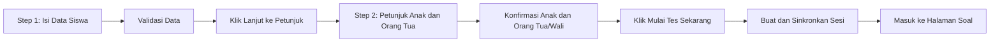

# 🚀 Petunjuk Pengerjaan & Syarat Ketentuan
## Kalananti Interactive Placement Test

Dokumen ini menjadi rancangan konten yang ditampilkan setelah data calon siswa diisi dan divalidasi di `index.html`, tetapi sebelum sesi Placement Test dibuat dan peserta masuk ke halaman soal.

Tujuan halaman ini adalah:

- membantu anak memahami cara mengerjakan tes;
- memastikan perangkat yang digunakan sesuai;
- menjelaskan peran orang tua/wali selama tes;
- meminta persetujuan penggunaan data untuk pelaksanaan tes dan pengiriman hasil;
- memastikan peserta memahami aturan pengerjaan sebelum memulai.

---

## 1. Informasi untuk Anak

### 🎮 Bentuk Soal Interaktif

- Soal memiliki berbagai bentuk interaktif, seperti memilih gambar, mengetuk jawaban, menyusun urutan, *drag-and-drop*, mengetik, dan menjalankan simulasi sederhana.
- Bentuk dan tingkat kesulitan soal disesuaikan dengan usia siswa.
- Baca, dengarkan, dan perhatikan petunjuk pada setiap soal sebelum menjawab.
- Tidak apa-apa jika ada soal yang terasa sulit. Jawablah sesuai kemampuanmu sendiri.

### ⏱️ Waktu Pengerjaan dan Fitur Lewati

- Pada soal kemampuan yang menggunakan timer, waktu maksimal pengerjaan adalah **2 menit**.
- Setelah **1 menit**, tombol **“Lewati Soal”** akan tersedia.
- Gunakan tombol tersebut jika kamu sudah mencoba tetapi masih merasa buntu.
- Jika waktu 2 menit habis, soal akan otomatis dilewati.
- Soal yang dilewati atau kehabisan waktu akan mendapatkan skor **0** untuk nomor tersebut.
- Timer tidak berlaku pada semua halaman. Ikuti petunjuk yang tampil pada setiap tahap tes.

### 🧭 Tahapan Adaptif

- Placement Test terdiri dari beberapa tahap untuk melihat kemampuan, kesiapan praktik, dan minat belajar siswa.
- Bagian fondasi memiliki rangkaian soal yang perlu diselesaikan.
- Pada tahap praktik adaptif, jumlah dan tingkat tantangan dapat berbeda sesuai jawaban siswa.
- Jawaban yang benar dapat membuka tantangan berikutnya untuk membantu sistem menemukan tingkat kemampuan yang paling sesuai.

### 🤖 Kerjakan dengan Jujur

- Kerjakan soal menggunakan kemampuanmu sendiri.
- Jangan menggunakan ChatGPT, Gemini, Claude, mesin pencari, atau bantuan AI lainnya untuk mencari jawaban.
- Jangan meminta orang lain memilih, menyusun, atau memberi tahu jawaban.
- Orang tua/wali hanya boleh membantu jika terdapat kendala teknis atau penggunaan perangkat, bukan membantu menjawab soal.

---

## 2. Informasi untuk Orang Tua/Wali

### 💻 Perangkat yang Digunakan

- **Sangat disarankan:** laptop atau komputer desktop dengan mouse.
- **Tablet:** dapat digunakan dalam posisi **landscape/mendatar** apabila ukuran layar memenuhi persyaratan.
- **Smartphone/HP:** tidak didukung dan akses akan diblokir oleh sistem.
- Pastikan ukuran jendela browser minimal **960 × 540 piksel**. Jika muncul peringatan ukuran layar, maksimalkan jendela browser.
- Pastikan koneksi internet stabil dan daya perangkat mencukupi sampai tes selesai.
- Penggunaan mouse lebih disarankan karena beberapa aktivitas *drag-and-drop* dapat terasa lebih sulit pada layar sentuh.

### 🛠️ Batas Bantuan Orang Tua/Wali

Orang tua/wali diperbolehkan membantu:

- menyiapkan perangkat dan koneksi internet;
- memperbesar atau memutar layar;
- mengaktifkan audio atau membantu jika suara tidak terdengar;
- menangani halaman yang tidak dapat dibuka atau kendala teknis lainnya.

Orang tua/wali tidak diperbolehkan:

- menjelaskan jawaban yang benar;
- memilih atau menyusun jawaban untuk anak;
- menggunakan AI, mesin pencari, atau sumber lain untuk membantu menjawab;
- mengerjakan sebagian atau seluruh tes atas nama anak.

### 🔄 Jika Tes Tertutup atau Terhenti

- Jika halaman tidak sengaja dimuat ulang atau browser tertutup, buka kembali tautan menggunakan **perangkat dan browser yang sama**.
- Sistem akan berusaha melanjutkan tes dari soal terakhir yang belum selesai.
- Jangan menggunakan mode Incognito/Private Browsing.
- Jangan menghapus data browser selama Placement Test berlangsung.
- Jika terjadi kendala teknis yang membuat tes tidak dapat dilanjutkan, hubungi Tim Kalananti dan jangan membuat sesi tes baru sebelum mendapatkan arahan.

---

## 3. Syarat & Ketentuan

### 3.1 Hasil dan Peninjauan Akademik

- Rekomendasi awal dihitung otomatis berdasarkan jawaban dan aktivitas siswa selama Placement Test.
- Hasil digunakan untuk membantu menentukan modul dan tingkat awal yang paling sesuai bagi siswa.
- Dalam kondisi tertentu—seperti data yang tidak lengkap, kendala teknis, atau kandidat penempatan khusus—hasil dapat ditinjau oleh Tim Akademik Kalananti.
- Penempatan pada tingkat khusus yang memerlukan portofolio atau verifikasi Academic Team tidak ditetapkan otomatis hanya berdasarkan hasil sistem.

### 3.2 Kerahasiaan Soal

- Rincian kunci jawaban dan pembahasan setiap soal tidak dibagikan kepada peserta atau orang tua/wali untuk menjaga kerahasiaan bank soal Kalananti.
- Orang tua/wali tetap akan menerima ringkasan hasil, profil kemampuan, dan rekomendasi pembelajaran yang relevan.
- Peserta dan orang tua/wali tidak diperbolehkan menyalin, merekam, menyebarkan, atau mempublikasikan soal Placement Test.

### 3.3 Kebijakan Pengerjaan dan Tes Ulang

- Placement Test ditujukan untuk dikerjakan **satu kali sebelum memulai program**.
- Jangan membuat sesi baru apabila tes sebelumnya belum selesai.
- Tes ulang hanya dapat dilakukan sesuai persetujuan atau arahan Tim Kalananti, misalnya setelah siswa menyelesaikan modul aktif atau jika terjadi kendala teknis yang terverifikasi.
- Penerapan pembatasan satu kali harus didukung pemeriksaan data peserta di backend dan jalur persetujuan tes ulang.

### 3.4 Penggunaan Data

Data yang digunakan dalam proses Placement Test dapat mencakup:

- nama atau nama panggilan siswa;
- usia siswa;
- cabang Kalananti;
- email orang tua/wali;
- progres, jawaban, skor, dan aktivitas pengerjaan;
- hasil penempatan dan rekomendasi pembelajaran.

Data tersebut digunakan untuk:

- membuat dan memulihkan sesi Placement Test;
- menghitung serta meninjau hasil akademik;
- menentukan rekomendasi modul dan tingkat awal;
- menyimpan progres dan bukti pengerjaan;
- membuat serta mengirimkan laporan hasil ke email orang tua/wali;
- membantu Tim Kalananti menangani kendala teknis atau akademik.

Jika Kalananti memiliki Kebijakan Privasi resmi, halaman ini harus menyediakan tautan menuju kebijakan tersebut dan informasi kontak untuk permintaan koreksi data.

---

## 4. Rancangan Alur di `index.html`

Alur registrasi menggunakan dua langkah:



### Step 1 — Data Calon Siswa

Field yang ditampilkan:

- Nama Panggilan Siswa
- Usia Siswa
- Email Orang Tua
- Cabang Kalananti

Tombol utama:

`[ LANJUT KE PETUNJUK ]`

Saat tombol ditekan:

1. validasi seluruh field;
2. simpan data sebagai draft sementara;
3. tampilkan Step 2;
4. **jangan membuat atau menyinkronkan sesi Placement Test terlebih dahulu**.

### Step 2 — Persiapan Placement Test

Disarankan menggunakan halaman/card penuh di dalam `index.html`, bukan modal kecil, agar seluruh informasi mudah dibaca.

Header:

> 🚀 Persiapan Misi Placement Test Kalananti

Ringkasan data yang ditampilkan:

- Nama siswa
- Usia
- Email orang tua
- Cabang

Kelompok informasi:

1. **Untuk Anak**
   - bentuk soal;
   - timer dan fitur Lewati;
   - pengerjaan mandiri;
   - tahapan adaptif.
2. **Untuk Orang Tua/Wali**
   - persyaratan perangkat;
   - batas bantuan;
   - pemulihan sesi;
   - penggunaan data dan pengiriman hasil.
3. **Ketentuan**
   - hasil dan peninjauan akademik;
   - kerahasiaan soal;
   - aturan satu kali pengerjaan dan tes ulang.

### Checkbox Konfirmasi

Gunakan dua checkbox agar peran anak dan orang tua/wali jelas:

```text
[ ] Aku siap mengerjakan menggunakan kemampuanku sendiri. Orang tua/wali hanya akan membantu jika ada kendala teknis.

[ ] Saya sebagai orang tua/wali telah membaca ketentuan, menyetujui penggunaan data untuk pelaksanaan Placement Test, dan memahami bahwa laporan hasil akan dikirimkan ke email yang didaftarkan.
```

Tombol:

- `[ KEMBALI EDIT DATA ]`
- `[ 🚀 MULAI TES SEKARANG ]`

Tombol **“Mulai Tes Sekarang”** harus disabled sampai kedua checkbox dicentang.

---

## 5. Catatan Implementasi

### Pembuatan Sesi

Pembuatan `submissionId`, penyimpanan registrasi, pemanggilan `PlacementSession.create()`, dan `PlacementSync.register()` dilakukan hanya setelah:

1. data registrasi valid;
2. kedua checkbox dicentang;
3. peserta menekan tombol **“Mulai Tes Sekarang”**.

Hal ini mencegah peserta yang baru membaca petunjuk atau membatalkan proses tercatat sebagai sesi aktif di backend.

### Bukti Persetujuan

Simpan informasi berikut bersama data registrasi:

```js
consent: {
  childConfirmed: true,
  guardianConfirmed: true,
  acceptedAt: new Date().toISOString(),
  termsVersion: "placement-tnc-v1"
}
```

`termsVersion` harus diperbarui jika isi syarat, penggunaan data, atau aturan pengerjaan berubah secara material.

### Perilaku Kembali dan Refresh

- Tombol **“Kembali Edit Data”** harus mempertahankan seluruh data yang sudah diisi.
- Jika Step 2 dimuat ulang sebelum sesi dibuat, draft dapat dipertahankan menggunakan `sessionStorage`.
- Sesi yang sudah dimulai dan belum selesai harus langsung melanjutkan ke halaman tes tanpa meminta persetujuan berulang, selama bukti persetujuan untuk versi ketentuan tersebut sudah tersimpan.
- Perlu ditentukan kebijakan migrasi untuk sesi lama yang belum memiliki `consent.acceptedAt` atau `termsVersion`.

### Persyaratan Sebelum Rilis

- Pastikan kebijakan perangkat di dokumen ini sama dengan `device-guard.js` dan PRD.
- Tentukan kontak bantuan teknis yang ditampilkan kepada orang tua/wali.
- Tambahkan tautan Kebijakan Privasi resmi jika tersedia.
- Tentukan serta uji mekanisme backend untuk aturan satu kali pengerjaan dan persetujuan tes ulang.
- Uji alur kembali, refresh pada Step 2, pembuatan sesi, resume sesi, dan pengiriman laporan hasil.
